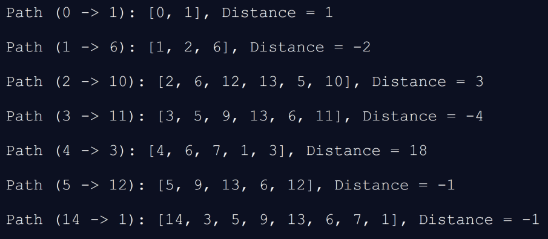

## Bellman Ford Java Implementation
### Given a directed, weighted graph containing positive and negative edge weights, a source node and destination node, this Java application utilizes the Bellman Ford algorithm to return the shortest path and distance from source to destination.

